# Explicacion Taller No_3

## 1) Primero creamos dos grupos uno llamado estudiante y otro profesor con el comando (groupadd) asi:

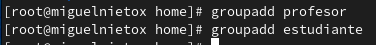

## 2) Segundo creamos tres usuarios uno llamados diana, laura y claudia  con el comando (adduser) asi:

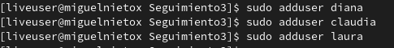

## 3) Tercero asignamos clases a los usuarios creados, diana sera profesora, laura estudiante y claudia profesora y estudiante con el comando (usermod -a -G nombre_grupo nombre_usuario) asi:

## 4) Creamos dos carpetas una llamada profesores y otra estudiantes con el comando (mkdir nombre_carpeta) luego damos permisos en las carpetas con el comando (chgrp nombre_grupo nombre_carpeta) y validamos que sea correcto asi:

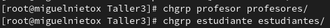
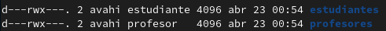

## 5) Probamos con los diferentes usuarios y estos permisos son correcots asi:

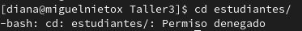
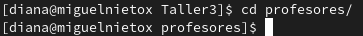
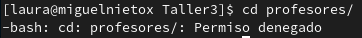
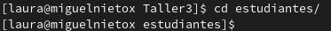
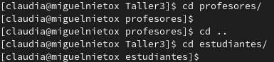

## 6) Creamos archivos en los respectivos directorios con el comando touch asi:

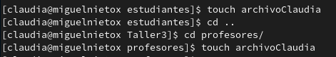
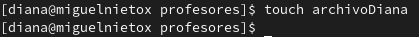
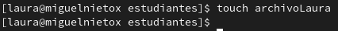
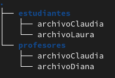

## 7) Cambiamos los dueños de estos archivos con el comando (chown nombre_usuario nombre_archivo) asi:

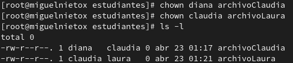
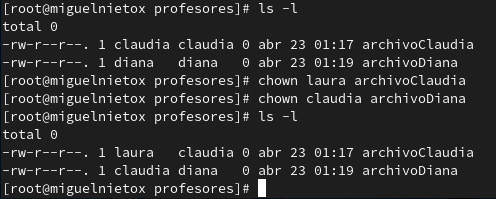

## 8) Intentamos entrar en el usuario laura colocando mal su clave de para que se guarde el numero de accesos fallidos asi:

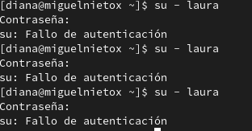

## 9) Ahora si accedemos a el usuario laura de forma correcta para ver el numero de intentos fallidos asi:

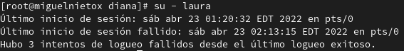

## 10) Despues comprimimos el contenido de los directorios de los profesores en profesore.tgz y el contenido del directorio de los directorio de los estudiantes de un archivo estudiantes.zip con el comando (tar -cvf nombre_nuevo_archivo nombre_archivo_comprimir) asi:

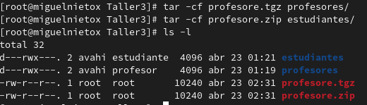

