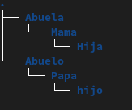
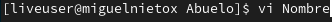

<h1>Explicacion Taller No_1</h1>
    
En este documento se evidencia los comandos y el paso a paso utilizados para realizar el taller No_1 (Manipulacion de archivos I)

    

    <h3>1. Iniciamos crando la estructura de carpetas</h3>
    
Para crear una carpeta utilizamos el comando ($ mkdir NombreCarpeta) asi:

    
    

    
Luego creamos la siguiente estructura de carpetas: 

    
    <h3>2. Despues creamos un archivo en cada una de las carpetas</h3>
    
Para crear un archivo nos situamos en la carpeta deseada con el comando ($ vi nombreArchivo) asi:

    
    

