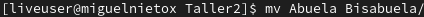
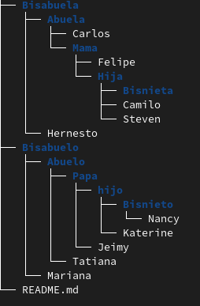

<h1>Explicacion Taller No_2</h1>
    
En este documento se evidencia los comandos y el paso a paso utilizados para realizar el taller No_2 (Manipulacion de archivos II)

    

    <h3>1. Iniciamos crando las carpetas (Bisabuelo, Bisabuela, Bisnieto, Bisnieta)</h3>
    
Creamos estas carpetas en nuestra raiz del proyecto asi:

    
    
    <h3>2. Despues movemos las carpetas de abuelos y bisnietos de la siguiente forma:</h3>
    
    
    
    
    <h3>3. Finalmente movemos los archivos de cada una de las carpetas a la carpeta contraria:</h3>
    
Es decir movemos el archivo de abuela a la carpeta de abuelo y el archivo de abuelo a la carpeta de abuela y asi con todas las carpetas asi:

    
